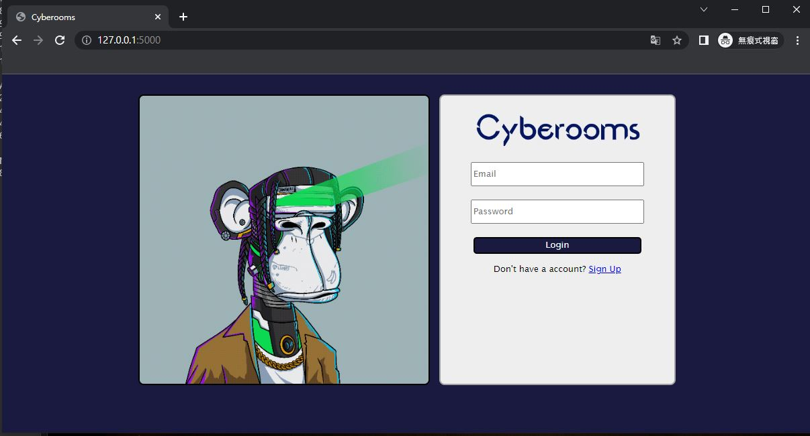
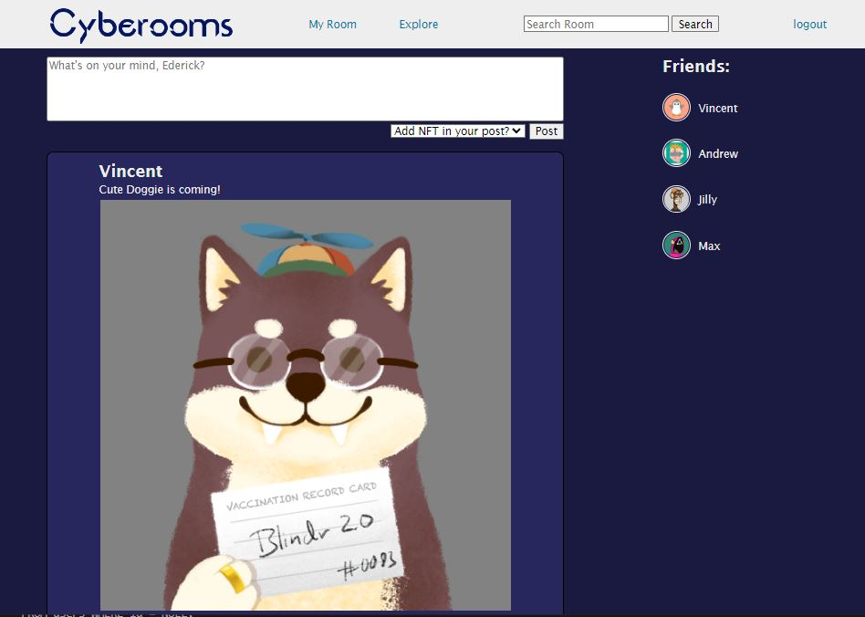
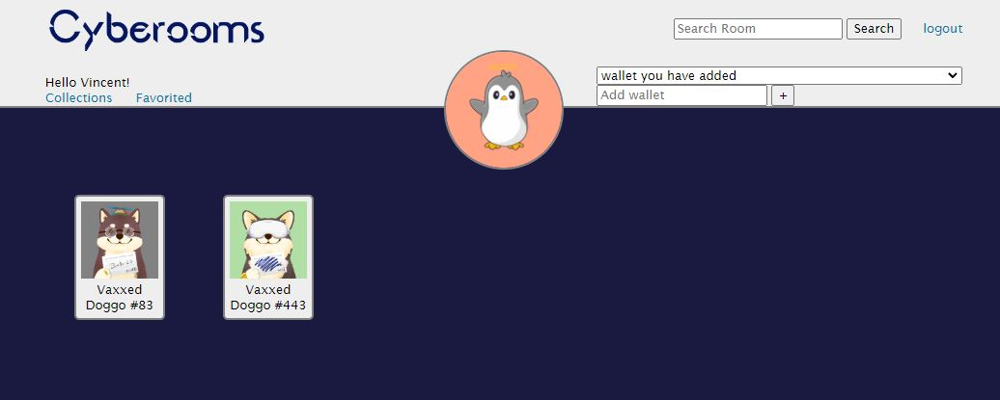

# Cyberoom

## About

**Cyberoom** is a NFTs sharing social networking service. The web app allows users to link their digital wallet and share their own NFTs collections with their friends or publicly. Users can also follows other users or their NFTs.




## Built with
Cyberoom is a flask based web-application project on Solana with a MySQL database. Solana-Nfts is used in this project for querying the NFTs on Solana. Solana-Nfts is a python package desgin by [CryptomafiaGG](mailto:cryptomafiagg@gmail.com).

* [Flask](https://flask.palletsprojects.com/en/2.2.x/)
* [Solana-Nfts](https://pypi.org/project/solana-nfts/)
* [MySQL](https://www.mysql.com/)
* [Flask-Bcrypt](https://flask-bcrypt.readthedocs.io/en/1.0.1/)

## Describtion
In the index page, users can post with or without your NFT. You can also check on others post.


Users will have their own NFTs room where their NFTs can be displayed shown as followed. Multiple digital wallets can be linked to one account. And all the NFTs in the linked account will be displayed in the room.



## How to use
After installing the dependencies in requirements.txt, samply run the following code to start the application.
```python
python server.py
```


## Contact Me
If you have any question or problem running this project just contact me: [zhongqianxinqqq@gmail.com](mailto:zhongqianxinqqq@gmail.com)